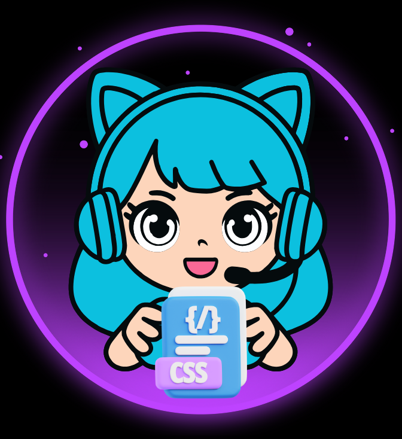

    

  
  

🌷🌷🌷🌷🌷🌷🌷🌷🌷🌷🌷🌷🌷🌷🌷🌷🌷🌷🌷🌷🌷🌷🌷🌷🌷🌷🌷🌷🌷🌷🌷🌷🌷🌷🌷🌷🌷🌷🌷🌷🌷🌷🌷🌷🌷🌷🌷🌷🌷🌷🌷🌷🌷🌷🌷🌷🌷🌷🌷🌷🌷🌷🌷🌷🌷🌷🌷🌷🌷🌷🌷

  

# Projeto E-Book  gerado por I.A.s

 > ℹ️ **NOTE:** Olá, eu sou a Rosa 👋 e preparei este e-book com muito carinho para você que vive (ou está começando) no mundo do desenvolvimento web — e que, assim como eu, ama katanas e códigos afiados.

🛡️🎉Entre linhas de código e decisões rápidas, onde cada caractere conta e a precisão é a diferença entre o caos e a elegância, o Visual Studio Code se ergue como a katana de um verdadeiro Pilar da programação.💡✨

✨ Te convido a continuar lendo este e-book.
💡Que este e-book seja o seu pergaminho de técnicas secretas.
💡Respire fundo, afie sua katana e entre no dojo com confiança.
💡Você está prestes a despertar o Pilar do Código que existe em você. 🗡️💻 ⚡💻

### 🟣 E-book gratuito para devs
> Domine seu editor como um verdadeiro Hashira do código!

📘 [📥 Baixar agora o e-book PDF](assets/E-book PRT.pdf)

<!-- <a href="https://web.dio.me/articles/domine-o-emmet-no-css-escreva-codigos-10x-mais-rapido-no-vs-code-8b3d3b3f9659?back=/articles" title="View PDF now"> 📕Clique aqui para ler o artigo</a> -->

## 💻 Tecnologias utilizadas no projeto

- [ChatGPT](https://chat.openai.com/) - para título e conteúdo
- [Canva](https://www.canva.com/) - para fazer tuda a diagramação

## 📄 Prompts e ferramentas

ChatGPT：

|   Ação   | prompt                                                                                                                                                                                                                                                                         |
| :------: | ------------------------------------------------------------------------------------------------------------------------------------------------------------------------------------------------------------------------------------------------------------------------------ |
|  título  | Crie 05 headlines para nomes épicos forte e direto sobre Visual Studio Code - Exemplo: Domine seu editor como um verdadeiro caçador de bugs.                                                                                                                                                                                                   |
| conteúdo | Faça um texto para o E-book , com foco em VS code, (Forte, direto e com o espírito “Hashira” do desenvolvimento)
 {REGRAS} |Explique sempre de uma maneira simples 

Canva

- No Canva, criei toda a diagramação do e-book.:

Canva.

## ✨ Features

- Conteúdo gerado via ChatGPT
- Diagramação no Canva pro.

## 📚 Materiais

- prompts utilizados

## 🛠️ Instruções de execução

Utilize os prompts acima nas ferramentas sugeridas para gerar o material base e use uma ferramenta de edição de documentos, como o Canva, para criar toda a estrutura.
## 👨‍💻 Expert

    
    
&nbsp&nbsp&nbspRosa Virginia Flores 
    &nbsp&nbsp&nbsp
    <a href="https://github.com/Rosavf">
    GitHub</a>&nbsp;|&nbsp;
    <a href="https://www.linkedin.com/in/rosa-virginia-flores/">LinkedIn</a>
&nbsp;|&nbsp;
    <a href="https://www.instagram.com/edt.creative/">
    Instagram</a>
&nbsp;|&nbsp;

  

---
🦋✨🌷✨🌷🌷
⌨ 👩‍💻 Mais que um E-book: é expressão –  [Rosa Virginia](https://github.com/Rosavf)